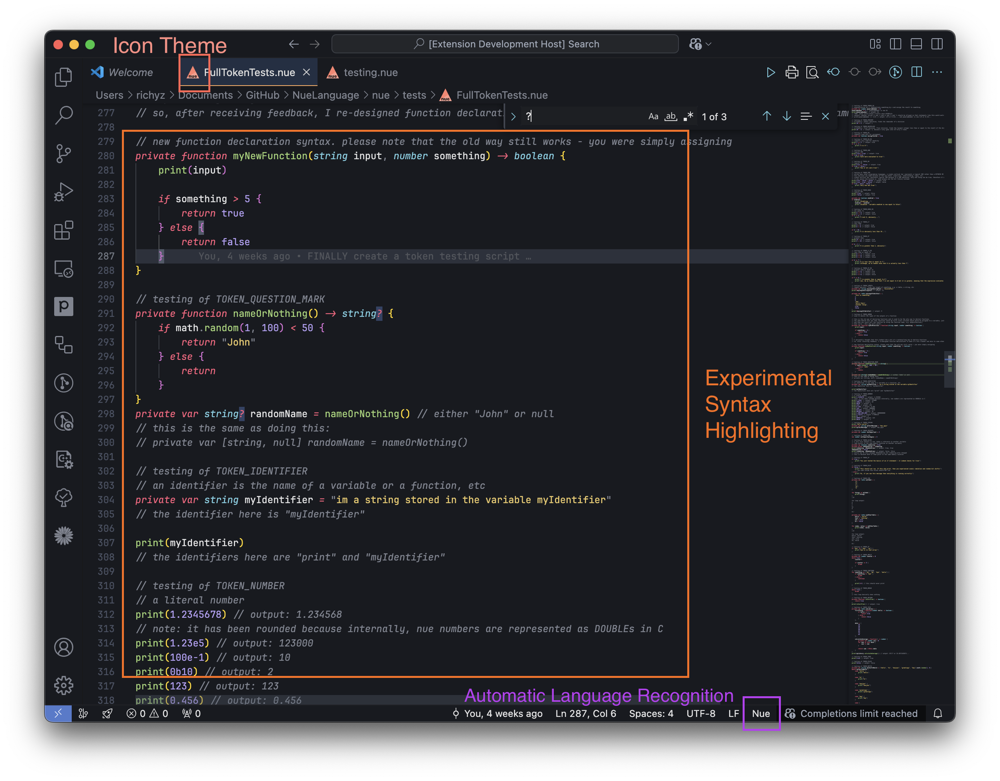

# 🍑 Nue Language Support for Visual Studio Code

***Experiencing Nue for the first time just got a whole lot better.***

An extension for Visual Studio Code which adds syntax highlighting, file associations, code recognition and a few other features like icons to support the Nue programming language.

At the moment, this extension adds weak support for Nue using TextMate grammars and other configurations.

A full LSP-based extension will be developed as Nue further progresses as a programming language in development.

## Features

- 🌈 Code highlighting
- ✨ Experimental code formatting

## Installation

Currently this extension works in Visual Studio Code and VSCodium, using either the extension provider of your choice or a generated `vsix` file.

- [Visual Studio Marketplace (For Visual Studio Code)](https://marketplace.visualstudio.com/items?itemName=NueLanguage.nue-vscode)
- [Open VSX (For VSCodium)](https://open-vsx.org/extension/NueLanguage/nue-vscode)
<!--
COMING SOON after CI has been set up, check IGNORE/TODO.md
- [`.vsix` file from GitHub Releases](https://github.com/NueLanguage/vscode-extension/releases)
-->

## Contributors
<!--
    turn this into a wall of profile pictures later
-->
- [@Richy-Z](https://github.com/Richy-Z)

## License

The Nue extension for Visual Studio code is licensed under the MIT license, as of 22.01.2024.
